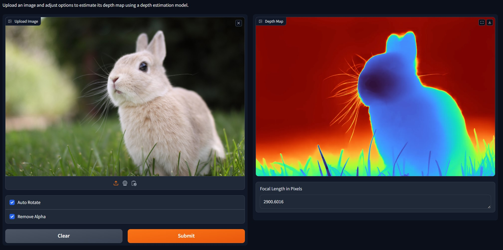

<h1 align="center"></h1>

<div align="center">
<h1>Web UI for Depth-Pro</h1>

<a href='https://huggingface.co/spaces/selmee/depth-pro'></a>
</div>

<p align="center">
  
</p>

Metric depth estimation determines real-world distances to objects in a scene from images. This repo provides a web UI that allows users to estimate metric depth and visualize depth maps by easily uploading images using the Depth Pro model through a simple Gradio UI interface.

## 🛠️ Getting Started

### 📦 Installation

1. **Create and activate a virtual environment:**

   ```bash
   conda create -n depth-pro -y python=3.9
   conda activate depth-pro
   ```

2. **Clone this and install the required library as follows:**

   ```bash
   git clone https://github.com/spacewalk01/depth-pro-webui.git
   cd depth-pro-webui
   pip install -r requirements.txt
   ```

3. **Download the model:**

   Download the model checkpoint [depth_pro.pt](https://ml-site.cdn-apple.com/models/depth-pro/depth_pro.pt) and place it in the `checkpoints` folder.

### 🚀 Running the Application

1. Launch the Gradio interface:

   ```bash
   python main.py
   ```

2. Open the provided local URL in your web browser to access the interface.

## 🖼️ Usage

1. **Upload an Image:** Use the image uploader to select an image for depth estimation.
2. **Adjust Options:**
   - **Auto Rotate:** Enable or disable auto-rotation of the image.
   - **Remove Alpha:** Enable or disable the removal of the alpha channel.
3. **View Results:**
   - The depth map will be displayed on the interface.
   - The focal length in pixels will also be shown.

## 📜 License

This project is licensed under the Apple License. See the [LICENSE](LICENSE) file for details.

## 🙏 Acknowledgments

- [Gradio](https://www.gradio.app/) for providing an easy interface for machine learning models.
- [Depth Pro](https://github.com/apple/ml-depth-pro.git) for enabling sharp monocular metric depth estimation in less than a second.
